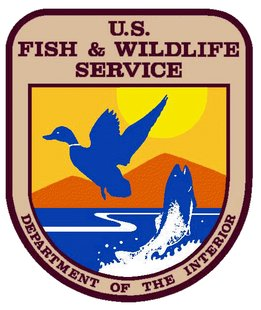

 

# Wetlands Mapper (swi)

The Wetlands mapper is designed to deliver easy-to-use, map like views of America?s Wetland resources. It integrates digital map data along with other resource information to produce current information on the status, extent, characteristics and functions of wetlands, riparian, and deepwater habitats. The Wetland Mapper fulfills the U.S. Fish and Wildlife Service?s strategic plan for the development, revision and dissemination of wetlands data and information to resource managers and the public. This information is intended  to promote the understanding and conservation of wetland resources through discovery and education as well as to aid in resource management, research and decision making.

The wetlands displayed on the Wetlands Mapper show wetland type and extent using a biological definition of wetlands. There is no attempt to define the limits of proprietary jurisdiction of any Federal, State, or local government, or to establish the geographical scope of the regulatory programs of government agencies.

### Prerequisites

[Node Package Manager](https://en.wikipedia.org/wiki/Npm_(software)) (npm)

## Getting Started

These instructions will get you a copy of the project up and running on your local machine for development and testing purposes. See deployment for notes on how to deploy the project on a live system.

run `npm install` AND `bower install` to get dependencies after first cloning

`gulp watch` to run in browser with watch for debugging

`gulp` to build project

## Building and testing

Explain how to run the debugging 'watch' script for this repo, if applicable

## Built With

* [NPM](https://www.npmjs.com/) - Dependency Management
* [gulp](https://en.wikipedia.org/wiki/Gulp.js) - Build system and task runner

## Contributing

Please read [CONTRIBUTING.md]() for details on the process for submitting pull requests to us. Please read [CODE_OF_CONDUCT.md]() for details on adhering by the [USGS Code of Scientific Conduct](https://www2.usgs.gov/fsp/fsp_code_of_scientific_conduct.asp).

## Versioning

We use [SemVer](http://semver.org/) for versioning. For the versions available, see the [tags on this repository](https://github.com/your/project/tags). 

Advance the version when adding features, fixing bugs or making minor enhancement. Follow semver principles. To add tag in git, type git tag v{major}.{minor}.{patch}. Example: git tag v2.0.5

To push tags to remote origin: `git push origin --tags`

*Note that your alias for the remote origin may differ.

## Authors

* **[Nicholas Estes](https://www.usgs.gov/staff-profiles/nicholas-j-estes)**  - *Lead Developer* - [USGS Web Informatics & Mapping](https://wim.usgs.gov/)

See also the list of [contributors](https://github.com/your/project/contributors) who participated in this project.

## License

This project is licensed under the Creative Commons CC0 1.0 Universal License - see the [LICENSE.md](LICENSE.md) file for details

## Suggested Citation
In the spirit of open source, please cite any re-use of the source code stored in this repository. Below is the suggested citation:

`This project contains code produced by the Web Informatics and Mapping (WiM) team at the United States Geological Survey (USGS). As a work of the United States Government, this project is in the public domain within the United States. https://wim.usgs.gov`

## About WIM
* This project authored by the [USGS WIM team](https://wim.usgs.gov)
* WIM is a team of developers and technologists who build and manage tools, software, web services, and databases to support USGS science and other federal government cooperators.
* WiM is a part of the [Upper Midwest Water Science Center](https://www.usgs.gov/centers/wisconsin-water-science-center).